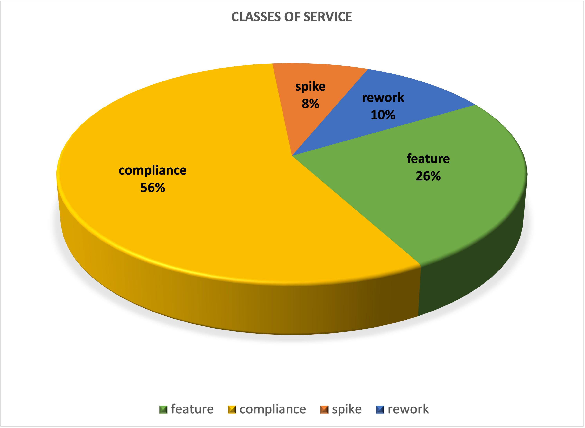

<!--suppress RequiredAttributes -->

<blockquote> <!-- .element: class="fragment" -->
  
<b>(it's not all there is to it)</b>
 
</blockquote>

notes:

- there's more to the 4 key metrics

next -> PLC case study started with my tweet

___

<!--suppress RequiredAttributes -->

<Blockquote><b>PLC Case Study</b></Blockquote>
 

 
 

**_[https://twitter.com/wilpannell/status/1485878534572679170](https://twitter.com/wilpannell/status/1485878534572679170)_**<!--
.element: style="font-size: 60%" -->

 

notes:

- PLC case study started with my tweet

next -> Personal Lifetime Communications

<!--suppress RequiredAttributes -->

<Blockquote><b>PLC Case Study</b></Blockquote>
 

 
 

**_[https://twitter.com/wilpannell/status/1485878534572679170](https://twitter.com/wilpannell/status/1485878534572679170)_**<!--
.element: style="font-size: 60%" -->

 

notes:

- PLC case study started with my tweet

next -> PLC

___
<!--suppress RequiredAttributes -->

  <Blockquote><b>Personal Lifetime Communications</b></Blockquote>
  
  <h4><b>(PLC Case Study @ CDCon 2022)<!-- .element: style="color:maroon; font-size:70%" --></b></h4>

notes:

- PLC

next -> product visionary: tara

___
<!--suppress RequiredAttributes -->

  <Blockquote><b>Personal Lifetime Communications</b></Blockquote>
  
  <h4><b>(PLC Case Study @ CDCon 2022)<!-- .element: style="color:maroon; font-size:70%" --></b></h4>

notes:

- product visionary: tara

next -> precocious PO: eileen

___
<!--suppress RequiredAttributes -->

  <Blockquote><b>Personal Lifetime Communications</b></Blockquote>
  
  <h4><b>(PLC Case Study @ CDCon 2022)<!-- .element: style="color:maroon; font-size:70%" --></b></h4>

notes:

- precocious PO: eileen

next -> tech lead: andrew

___
<!--suppress RequiredAttributes -->

  <Blockquote><b>Personal Lifetime Communications</b></Blockquote>
  
  <h4><b>(PLC Case Study @ CDCon 2022)<!-- .element: style="color:maroon; font-size:70%" --></b></h4>

notes:

- tech lead: andrew

next -> the youngest dev and the front end lead: jeremy

___
<!--suppress RequiredAttributes -->

  <Blockquote><b>Personal Lifetime Communications</b></Blockquote>
  
  <h4><b>(PLC Case Study @ CDCon 2022)<!-- .element: style="color:maroon; font-size:70%" --></b></h4>

notes:

- the youngest dev and the front end lead: jeremy

next -> shanaz

___
<!--suppress RequiredAttributes -->

  <Blockquote><b>Personal Lifetime Communications</b></Blockquote>
  
  <h4><b>(PLC Case Study @ CDCon 2022)<!-- .element: style="color:maroon; font-size:70%" --></b></h4>

notes:

- shanaz

next -> together shanaz and jeremy were part of the original tiger team

___
<!--suppress RequiredAttributes -->

  <Blockquote><b>Personal Lifetime Communications</b></Blockquote>
  
  <h4><b>(PLC Case Study @ CDCon 2022)<!-- .element: style="color:maroon; font-size:70%" --></b></h4>

notes:

- together shanaz and jeremy were part of the original tiger team

next -> concentrated on deployment frequency

___
<Blockquote><b>Personal Lifetime Communications</b></Blockquote>

<iframe date-preload data-src="https://humanitec.com/blog/deployment-frequency-key-metric-in-devops" width="850px" height="425px"></iframe>

**_[https://humanitec.com/blog/deployment-frequency-key-metric-in-devops](https://humanitec.com/blog/deployment-frequency-key-metric-in-devops)_**<!--
.element: style="font-size: 30%" -->

<h4><b>(PLC Case Study @ CDCon
2022)<!-- .element: style="color:maroon; font-size:70%" --></b></h4>

notes:

- concentrated on deployment frequency

next -> PLC's improvement in 2021

___

> ## PLC's 6-months of Improvement through Q4 2021<!-- .element: style="color:purple" -->

notes:

- started tracking DORA metrics in the summer of 2021

next -> PLC's work distribution in Q2 2021

___
<!--suppress RequiredAttributes -->

  <Blockquote><b>PLC's distribution of work</b></Blockquote>
  
  <h4><b>(Q2 2021)<!-- .element: style="color:maroon; font-size:70%" --></b></h4>

notes:

- hardly any feature work in Q2 2021

next -> PLC's work distribution in Q3 2021

___
<!--suppress RequiredAttributes -->

  <Blockquote><b>PLC's work distribution</b></Blockquote>
  
  <h4><b>(Q3 2021)<!-- .element: style="color:maroon; font-size:70%" --></b></h4>

notes:

- started tracking DORA at start of Q3 2021

next -> PLC's work distribution in Q4 2021

___
<!--suppress RequiredAttributes -->

  <Blockquote><b>PLC's work distribution</b></Blockquote>
  
  <h4><b>(Q4 2021)<!-- .element: style="color:maroon; font-size:70%" --></b></h4>

notes:

- healthy distribution of work; spikes and rework imply innovation and learning

next -> PLC's innovations

___
> ### PLC's innovations

**tdd** <!-- .element: style="color:maroon; font-size:70%" -->

**small
batches** <!-- .element: class="fragment" style="color:maroon; font-size:70%" -->

**consumer-driven
contracts** <!-- .element: class="fragment" style="color:maroon; font-size:70%" -->

**trunk-based
development** <!-- .element: class="fragment" style="color:maroon; font-size:70%" -->

**continuous integration and
deployment** <!-- .element: class="fragment" style="color:maroon; font-size:70%" -->

**tdd** <!-- .element: style="color:maroon; font-size:70%" -->

**mob programming** <!-- .element: style="color:maroon; font-size:70%" -->

<h4><b>(Q4 2021)<!-- .element: style="color:maroon; font-size:70%" --></b></h4>

notes:

- PLC's innovations
- trunk-based development
- continuous integration and deployment
- small batch sizes

- mob programming
- pomodoro timing
- limited WIP
- angular
- tailwind
- webcomponents
- reactive extensions
- optimizely
- mono repo

next -> PLC's speed in Q1 2021

___
<!--suppress RequiredAttributes -->

  <Blockquote><b>PLC's speed</b></Blockquote>
   
  
   
   
   
   
  <h4><b>(Q1 2021)<!-- .element: style="color:maroon; font-size:70%" --></b></h4>

notes:

- pull requests and long-lived feature branches

next -> PLC's speed in Q4 2021

___
<!--suppress RequiredAttributes -->

  <Blockquote><b>PLC's speed</b></Blockquote>
   
  
   
   
   
   
  <h4><b>(Q4 2021)<!-- .element: style="color:maroon; font-size:70%" --></b></h4>

notes:

- trunk-based development
- continuous integration and deployment
- small batch sizes

- mob programming
- pomodoro timing
- limited WIP
- angular
- tailwind
- webcomponents
- reactive extensions
- optimizely
- mono repo

next -> throughput trending up

___
<!--suppress RequiredAttributes -->

  <Blockquote><b>PLC's throughput trending up</b></Blockquote>
  
  <h4><b>(2021)<!-- .element: style="color:maroon; font-size:70%" --></b></h4>

notes:

- throughput trending up

next -> cycle time trending down

___
<!--suppress RequiredAttributes -->

  <Blockquote><b>PLC's cycle time trending down</b></Blockquote>
  
   
   
   
  <h4><b>(2021)<!-- .element: style="color:maroon; font-size:70%" --></b></h4>

notes:

- cycle time trending down

next -> PLC's net flow in Q2 2021

___
<!--suppress RequiredAttributes -->

  <Blockquote><b>PLC's net flow evening out</b></Blockquote>
  
  <h4><b>(2021)<!-- .element: style="color:maroon; font-size:70%" --></b></h4>

notes:

- PLC's net flow in Q2 2021
- slope was steeper earlier in Q3

next -> The State of DevOps Reports Home Page

___

<iframe date-preload data-src="https://www.devops-research.com/research.html#reports" width="900px" height="450px"></iframe>

**_[https://www.devops-research.com/research.html#reports](https://www.devops-research.com/quickcheck.html#questions)_**<!--
.element: style="font-size: 60%" -->

notes:

- started in 2012 @ puppet labs
- years 2014-2021 found ons cloud.google.com/devops-reports
- 2020 missing due to the pandemic

next -> started in 2012 with Soo Choi

___
<!--suppress RequiredAttributes -->

  <Blockquote><b>Soo Choi</b></Blockquote>
  
  <h4><b>NASA, Anso Labs, OpenStack co-founder, Rackspace, Chef Software<!-- .element: style="color:maroon; font-size:70%" --></b></h4>

 
 
 
 

notes:

- Soo Choi started the DevOps surveys @ puppet labs in 2012

next -> Jez Humble

___
<!--suppress RequiredAttributes -->

  <Blockquote><b>Jez Humble</b></Blockquote>
  
  

 
 
 
 

notes:

- Jez Humble needs no introduction
- joined the DevOps surveys @ puppet labs in 2014
- published 2nd edition of the DevOps Handbook last year

next -> Gene

___
<!--suppress RequiredAttributes -->

  <Blockquote><b>Gene Kim</b></Blockquote>
  
  

 
 
 
 

notes:

- Gene Kim is prolific in ops
- runs itRevolution.com
- also joined the DevOps surveys @ puppet labs in 2014

next -> Nicole

___
<!--suppress RequiredAttributes -->

  <Blockquote><b>Dr. Nicole Forsgren</b></Blockquote>
  
  <h4><b>
   Dr. Nicole Forsgren is a Partner at Microsoft Research, where she leads <em>Developer Velocity Lab</em>.  She is best known for her work measuring the technology process.<!-- .element: style="color: maroon" -->  
  </b></h4>

 
 

notes:

- Nicole leads the science behind the DORA studies
- has taken no prisoners in demanding credit for her leadership of DORA from her
  misogynist detractors

next -> DORA / accelerate

___
<!--suppress RequiredAttributes -->

  <Blockquote><b>DORA</b></Blockquote>
  

     
     <!-- .element: class="fragment" -->
     <!-- .element: class="fragment" -->
     <!-- .element: class="fragment" -->
     <!-- .element: class="fragment" -->
  

  
 <!-- .element: class="fragment" -->
    
    
    
  

 
 
notes:

- Accelerate was published in 2018

next -> survey responses

___

  <Blockquote><b>survey responses</b></Blockquote>
   

 
 

notes:

- more than 32,000 total survey responses

next -> definition of devops

___

 

### DevOps

**_[Accelerate State of DevOps Report Results 2019](https://www.youtube.com/watch?v=Fzu5Ry5lU8c)_**<!--
.element: style="font-size: 60%" -->

notes:

- explain cluster analysis
- explain latent construct
- explain likert-type scales

next -> emphasize culture and technicialk

___

 

### DevOps

**_[Accelerate State of DevOps Report Results 2019](https://www.youtube.com/watch?v=Fzu5Ry5lU8c)_**<!--
.element: style="font-size: 60%" -->

notes:

- first how to measure technical
- then how to measure cultural

- explain
- cluster analysis
- likert-type scales
- psychometrics
- latent construct

next -> measures

___

  <Blockquote><h2>methodology</h2></Blockquote>
   
  <h3>statistical cluster analysis<!-- .element: style="color:blue" --></h3> <!-- .element: class="fragment" -->
  <h3>likert-type scales<!-- .element: style="color:blue" --></h3> <!-- .element: class="fragment" -->
  <h3>psychometrics<!-- .element: style="color:blue" --></h3> <!-- .element: class="fragment" -->
  <h3>latent constructs<!-- .element: style="color:blue" --></h3> <!-- .element: class="fragment" -->
  

notes:

- measures of organizational performance
- talk about measures of software delivery performance
- talk about measures of organizational culture
- explain measures of transformational leadership
- explain measures of loosely coupled architecture and teams

next -> measures

___

  <Blockquote><h2>measures</h2></Blockquote>
  <h3>organizational performance<!-- .element: style="color:blue" --></h3> <!-- .element: class="fragment" -->
  <h3>software delivery performance<!-- .element: style="color:blue" --></h3> <!-- .element: class="fragment" -->
  <h3>culture<!-- .element: style="color:blue" --></h3> <!-- .element: class="fragment" -->
  <Blockquote><h2>additional measures <!-- .element style="color:maroon" --></h2></Blockquote> <!-- .element: class="fragment" -->
  <h3>transformational leadership<!-- .element: style="color:blue" --></h3> <!-- .element: class="fragment" -->
  <h3>loosely coupled architecture and teams<!-- .element: style="color:blue" --></h3> <!-- .element: class="fragment" -->
  

notes:

next -> measures of organizational performance are well-known

___

  <Blockquote><h2>measures of organizational performance</h2></Blockquote>
  <h3>productivity<!-- .element: style="color:blue" --></h3> <!-- .element: class="fragment" -->
  <h3>profitability<!-- .element: style="color:blue" --></h3> <!-- .element: class="fragment" -->
  <h3>market share<!-- .element: style="color:blue" --></h3> <!-- .element: class="fragment" -->
  

notes: measures of organizational performance are well-known

next -> how to measure software delivery performance?

___

  <Blockquote><h3>how to measure software delivery performance?</h3></Blockquote>
  
  

notes: next

next -> 4 keys

___

  <Blockquote><h3>how to measure software delivery performance?</h3></Blockquote>
  
  <h4><b>(these are the 4 key metrics) <!-- .element: style="color:maroon; font-size:70%" --></b></h4>

notes: these are the 4 key metrics

next -> likert-type scales

___

### likert-type scale clusters

> #### "A Likert scale is a rating scale used to assess opinions, attitudes, or behaviors ...  To collect data, you present participants with Likert-type questions or statements and a continuum of possible responses, usually with 5 or 7 items, Each item is given a numerical score so that the data can be analyzed quantitatively." <!-- .element: style="font-size: 95%; color: purple" -->

**_[Designing and Analyzing a Likert Scale | Guide & Examples](https://www.scribbr.com/methodology/likert-scale/)_**<!--
.element: style="font-size: 60%" -->

notes: a survey response based on likert-type scales reduces to a single number
that can trend

next -> e.g., DORA quick-assessment

___

<iframe date-preload data-src="https://www.devops-research.com/quickcheck.html#questions" width="900px" height="450px"></iframe>

**_[DORA Quick Assessment](https://www.devops-research.com/quickcheck.html#questions)_**<!--
.element: style="font-size: 60%" -->

notes:

- this is how DORA collects data
- this is also one way to baseline a team's software delivery performance

next -> key finding: software delivery performance ⇒ organizational performance

___

  <Blockquote><h2>software delivery performance</h2></Blockquote>
  <h4>predicts</h4> <!-- .element: style="color:maroon" -->
  <Blockquote><h2>organizational performance</h2></Blockquote>

notes: key finding: software delivery performance ⇒ organizational performance

next -> IT performance is statistically predictive of organizational performance

___

> ### "Firms with high-performing IT organizations were twice as likely to exceed their profitability, market share and productivity goals."<!-- .element: style="color:purple" -->

notes: from State of Devops Report 2016

next -> DORA ... prescribes a recipe for improving software delivery performance

___

  <Blockquote><h2>DORA</h2></Blockquote>
  
  <h4>prescribes a recipe for improving software delivery performance</h4> <!-- .element: class="fragment" -->

notes:

- DORA ... prescribes a recipe for improving software delivery performance
- it's like cooking ... as simple as following the recipe

next -> results of statistical cluster analysis

___

  <Blockquote><h2 class="r-fit-text">statistical cluster analysis</h2></Blockquote>
  

     <!-- .element: class="fragment" -->
     <!-- .element: class="fragment" -->
     <!-- .element: class="fragment" -->
     <!-- .element: class="fragment" -->
     <!-- .element: class="fragment" -->
     <!-- .element: class="fragment" -->
  

notes:

- low: low-performing teams
- medium: medium-performing teams
- high: high-performing teams
- elite: elite-performing teams
- if we don't achieve business outcomes, then we are probably low performers

next -> elite performers ... don't trade speed for stability

___

  

    
    
    
    <h4><b>(elite performers don't trade speed for stability) <!-- .element: class="fragment" style="color:maroon; font-size:70%" --></b></h4>
  

notes:

- elite performers ... don't trade speed for stability
- speed moves with stability for elite performers

next -> amazon doesn't trade speed

___

  

    
    
  

notes:

- blow this up
- doesn't trade speed for stability
- this was 10 years ago...imagine now

next -> google doesn't trade speed for stability

___

  

    
    
  

notes:

- blow this up
- google doesn't trade speed for stability

next -> google testing scale

___

  

    
    
  

notes:

- blow this up
- google testing scale

next -> how to measure speed? fragment

___

  

    <h4>how to measure speed?</h4>
    <h4><b> </b></h4> <!-- .element: style="color:green; font-size:70%" -->
    
  

notes:

- how to measure speed? fragment

next -> deployment frequency subtitle ... speed/deployment frequency image
fragment

___

  

    <h4>how to measure speed?</h4>
    <h4><b>deployment frequency</b></h4> <!-- .element: style="color:green; font-size:70%" -->
     <!-- .element: class="fragment" -->
  

notes:

- deployment frequency subtitle ... speed/deployment frequency image fragment

next -> deployment frequency question fragment

___

  

    <h4>how to measure speed?</h4>
    <h4><b>deployment frequency</b></h4> <!-- .element: style="color:green; font-size:70%" -->
    
  

notes:

- deployment frequency question fragment

next -> deployment frequency segment final fragment

___

  

    <h4>how to measure speed?</h4>
    <h4><b>deployment frequency</b></h4> <!-- .element: style="color:green; font-size:70%" -->
    
  

notes:

- deployment frequency segment final fragment

next -> lead time subtitle ... speed/lead time image fragment

___

  

    <h4>how to measure speed?</h4>
    <h4><b>lead time</b></h4> <!-- .element: style="color:green; font-size:70%" -->
     <!-- .element: class="fragment" -->
  

notes:

- lead time subtitle ... speed/lead time image fragment

next -> lead time question fragment

___

  

    <h4>how to measure speed?</h4>
    <h4><b>lead time</b></h4> <!-- .element: style="color:green; font-size:70%" -->
    
  

notes:

- lead time question fragment

next -> lead time segment final fragment

___

  

    <h4>how to measure speed?</h4>
    <h4><b>lead time</b></h4> <!-- .element: style="color:green; font-size:70%" -->
    
  

notes:

- lead time segment final fragment

next -> how to measure stability? fragment

___

  

    <h4>how to measure stability?</h4>
    <h4><b> </b></h4> <!-- .element: style="color:green; font-size:70%" -->
     
  

notes:

- how to measure stability? fragment

next -> mttr subtitle ... stability/mttr image fragment

___

  

    <h4>how to measure stability?</h4>
    <h4><b>time to restore service</b></h4> <!-- .element: style="color:maroon; font-size:70%" -->
     <!-- .element: class="fragment" -->
  

notes:

- mttr subtitle ... stability/mttr image fragment

next -> mttr question fragment

___

  

    <h4>how to measure stability?</h4>
    <h4><b>time to restore service</b></h4> <!-- .element: style="color:maroon; font-size:70%" -->
    
  

notes:

- mttr question fragment

next -> mttr segment final fragment

___

  

    <h4>how to measure stability?</h4>
    <h4><b>time to restore service</b></h4> <!-- .element: style="color:maroon; font-size:70%" -->
    
  

notes:

- mttr segment final fragment

next -> change failure rate subtitle ... stability/change failure rate image
fragment

___

  

    <h4>how to measure stability?</h4>
    <h4><b>change failure rate</b></h4> <!-- .element: style="color:maroon; font-size:70%" -->
     <!-- .element: class="fragment" -->
  

notes:

- change failure rate subtitle ... stability/change failure rate image fragment

next -> change failure rate question fragment

___

  

    <h4>how to measure stability?</h4>
    <h4><b>change failure rate</b></h4> <!-- .element: style="color:maroon; font-size:70%" -->
    
  

notes:

- change failure rate question fragment

next -> change failure rate segment final fragment

___

  

    <h4>how to measure stability?</h4>
    <h4><b>change failure rate</b></h4> <!-- .element: style="color:maroon; font-size:70%" -->
    
  

notes:

- change failure rate segment final fragment

next -> balanced scorecard

___
  <Blockquote><b>the 4 key metrics </b></Blockquote>
  
   
  <h4><b>(constitute a balanced scorecard)<!-- .element: style="color:maroon; font-size:70%" --></b></h4>

notes: balanced scorecard

next -> Account Manager's DORA Dashboard

___
<!--suppress RequiredAttributes -->

  <Blockquote><b>Account Manager's DORA Dashboard</b></Blockquote>
  
   
   
  <h4><b>(2022)<!-- .element: style="color:maroon; font-size:70%" --></b></h4>

notes:

- Account Manager's DORA Dashboard
- the 4 key metrics are meant to be tracked together

___
<!--suppress RequiredAttributes -->

  <Blockquote><b>PLC's DORA Dashboard</b></Blockquote>
  
   
   
  <h4><b>(2022)<!-- .element: style="color:maroon; font-size:70%" --></b></h4>

notes:

- PLC's DORA Dashboard

next -> key finding:  organizational culture ⇒ software delivery performance

___

  <Blockquote><h2>organizational culture</h2></Blockquote>
  <h4>predicts</h4> <!-- .element: style="color:maroon" -->
  <Blockquote><h2>software delivery performance</h2></Blockquote>

notes:

- organizational culture predicts software delivery performance
- software delivery performance predicts organizational performance
- therefore, organizational culture predicts organizational performance

next -> let's define culture

___

 

### what is culture?

> #### "A pattern of shared tacit assumptions that was learned by a group as it solved its problems of external adaptation and internal integration, that has worked well enough to be considered valid and, therefore, to be taught to new members as the correct way to perceive, think, and feel in relation to those problems." <!-- .element: style="color: purple" class="fragment"  -->

**Edgar Schein, <!-- .element: style="color:maroon; font-size: 60%" -->
_[The Corporate Culture Survival Guide](https://www.amazon.com/Corporate-Culture-Survival-Guide-Revised/dp/1511383690)_** <!-- .element: class="fragment" -->

notes:

- definition of culture

next -> alternative definition of culture

___

 

### what is culture?

> #### "Our true culture is made primarily of the things no one will say... Culture is about power dynamics, unspoken priorities and beliefs, mytholgies, conflicts, enforcement of social norms, creation of in/out groups and distribution of wealth and control inside companies." <!-- .element: style="color: purple" -->

**Shanley Kane (@shanley)
, <!-- .element: style="color:maroon; font-size: 60%" -->
_[Your Startup is Broken: Inside the Toxic Heart of Tech Culture](https://oneibmcloud.github.io/ibm-cloud-garage-developer-bootcamp/resources/YourStartupIsBroken.pdf)_**

 

notes:

- alternative definition of culture

next -> organizational culture predicts software delivery performance

___

 

> ### "organizational culture is one of the strongest predictors of both IT performance and the overall performance of the organization." <!-- .element: style="color: purple" -->

**_[(State of DevOps Report)](https://puppet.com/resources/report/2016-state-devops-report?ccn=devops-PMG-2016&cid=701G00000016yPn&gclid=CLHB07zSpdICFUOXfgodew4Dqw&ls=paid-search&pcnav=off&pctiles=off&pub=google&utm_campaign=devops-PMG-2016&utm_content=2016-devops-report&utm_medium=paid-search&utm_source=google)_**  <!-- .element: style="font-size: 60%" -->

 

notes:

- organizational culture predicts software delivery performance
- you can change culture
- (deliberately ... meticulously)
- cannot read culture like a book
- you can observe and naively/unscientifically infer culture
- but you can scientifically measure culture

next -> how to measure culture?

___

 

> ## how to measure organizational culture?<!-- .element: style="color: purple" -->

notes:

- how to measure culture?

next -> psychometrics

___

### psychometrics

> #### "Psychometrics generally refers to specialized fields within psychology and education devoted to testing, measurement, assessment, and related activities. [It] is concerned with the objective measurement of latent constructs that cannot be directly observed." <!-- .element: style="color: purple" -->

**_[National Council on Measurement in Education](https://web.archive.org/web/20170722194028/http://www.ncme.org/ncme/NCME/Resource_Center/Glossary/NCME/Resource_Center/Glossary1.aspx?hkey=4bb87415-44dc-4088-9ed9-e8515326a061#anchorP)_**<!--
.element: style="font-size: 60%" -->

notes:

- psychometrics

next -> latent construct

___

### latent construct

> #### "latent [constructs] ... are variables that are not directly observed but are rather inferred through a mathematical model from other variables that are observed (directly measured). Examples of latent constructs include intelligence, introversion, mental disorders, and educational achievement." <!-- .element: style="color: purple" -->

**_[Using Multivariate Analysis](https://www.google.com/books/edition/Using_Multivariate_Statistics/lVtqAAAAMAAJ?hl=en&gbpv=0&kptab=morebyauthor)_**<!--
.element: style="font-size: 60%" -->

notes:

- latent constructs manifest as likert-type questions
- models have previously been validated by psycho-metricians
- where they have not, they've been subject to rigorous analysis

next -> culture survey

___

 

<iframe class="r-stretch" date-preload data-src="https://surveyjs.io/published?id=616b7d13-0868-48fa-af7a-1da046381239" width="640px" height="480px"></iframe>

notes:

- culture survey

next -> Westrum Typology

___

 

  <Blockquote><b>Westrum Typology</b></Blockquote>
  

notes: key finding

next -> transformational leadership

___

  <Blockquote><h2>transformational leadership</h2></Blockquote>
  <h4>predicts</h4> <!-- .element: style="color:maroon" -->
  <Blockquote><h2>organizational culture</h2></Blockquote>
  
<b>(pending)</b>
 <!-- .element: style="color:maroon" -->

notes: key finding

next -> loosely coupled architecture and teams

___

  <Blockquote><h2>loosely coupled architecture and teams</h2></Blockquote>
  <h4>predicts</h4> <!-- .element: style="color:maroon" -->
  <Blockquote><h2>software delivery performance</h2></Blockquote>
  
<b>(pending)</b>
 <!-- .element: style="color:maroon" -->

notes: key finding

next -> return on investment

___

  <Blockquote><h2>return on investment</h2></Blockquote>
  
<b>(pending)</b>
 <!-- .element: style="color:maroon" -->

notes: key finding

next -> how to improve?

___

  <Blockquote><h2>how to improve?</h2></Blockquote>
  
<b>(pending)</b>
 <!-- .element: style="color:maroon" -->

notes: key finding

