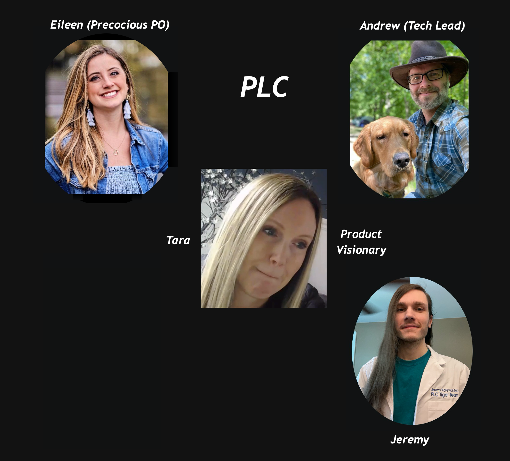

<!--suppress RequiredAttributes -->

<blockquote> <!-- .element: class="fragment" -->
  
<b>(it's not all there is to it)</b>
 
</blockquote>

notes:

- some folk talk about the 4-keys in isolation as if that's all there is to it
- (advance fragment)
- emphasize that there's **_way way_** more to DORA than just the 4 key metrics
- it's a systematic behavioral improvement system
-
- improvements can be deliberately planned and measured
- any Ford Credit stream-aligned, platform or enabling team can do it

next -> describe how the PLC case study started with my tweet
___
> ### Where we Ended Up

 

#### (PLC Case Study @ CDCon 2022) <!-- .element: style="color:maroon; font-weight:bold; font-size:70%"  -->

[**_https://twitter.com/wilpannell/status/1485878534572679170_**](https://twitter.com/wilpannell/status/1485878534572679170)<!--
.element: style="font-size: 60%" -->

notes:

- I'd been working with the Google opensource 4-keys project
- Google saw my tweet
- (open the link to the tweet in a new tab)
- they asked if they could present the PLC Case Study at CDcon

next -> start with the agenda
___
> ### Agenda

- PLC case study <!-- .element: style="color:maroon; font-weight:bold;" -->
- origins and authors of the study <!-- .element: class="fragment" style="color:maroon; font-weight:bold;  " -->
- the science <!-- .element: class="fragment" style="color:maroon; font-weight:bold;  " -->
- what it predicts about behavior <!-- .element: class="fragment" style="color:maroon; font-weight:bold;  " -->
- the measures <!-- .element: class="fragment" style="color:maroon; font-weight:bold;  " -->
- culture <!-- .element: class="fragment" style="color:maroon; font-weight:bold;  " -->
- transformational leadership <!-- .element: class="fragment" style="color:maroon; font-weight:bold;  " -->
- loosely coupled architecture and teams <!-- .element: class="fragment" style="color:maroon; font-weight:bold;  " -->

notes:

- let's start with the PLC Case Study
- (advance fragment)
- walk through the table of contents
-
- what's most important is what the science predicts about behavior

next -> start with the PLC Case Study
___
> ### Agenda

 

- PLC case study <!-- .element: style="color:maroon; font-weight:bold;" -->
- origins and authors of the study <!-- .element: style="color:#e0dfe4; font-weight:bold;  " -->
- the science <!-- .element: style="color:#e0dfe4; font-weight:bold;  " -->
- what it predicts about behavior <!-- .element: style="color:#e0dfe4; font-weight:bold;  " -->
- the measures <!-- .element: style="color:#e0dfe4; font-weight:bold;  " -->
- culture <!-- .element: style="color:#e0dfe4; font-weight:bold;  " -->
- transformational leadership <!-- .element: style="color:#e0dfe4; font-weight:bold;  " -->
- loosely coupled architecture and teams <!-- .element: style="color:#e0dfe4; font-weight:bold;  " -->

notes:

- I wish to start with the PLC case study

next -> starts with PLC
___
> #### Personal Lifetime Communications

#### (PLC Case Study @ CDCon 2022)<!-- .element: style="color:maroon; font-weight:bold; font-size:70%" -->

notes:

- PLC has perhaps the youngest core team of any at Ford Credit

next -> the whole team revolves around the product visionary
___
> #### Personal Lifetime Communications

#### (PLC Case Study @ CDCon 2022)<!-- .element: style="color:maroon; font-weight:bold; font-size:70%" -->

notes:

- tara
-
- is a group product owner in Julien's organization
- she's a font of stream of consciousness of great product ideas
- everyone of which sounds like they can make good money

next -> is our precocious PO
___
> #### Personal Lifetime Communications

#### (PLC Case Study @ CDCon 2022)<!-- .element: style="color:maroon; font-weight:bold; font-size:70%" -->

notes:

- eileen
-
- was a first-time product owner from the customer service organization
- she has a dynamic relationship with her developers
- she joins them throughout the day in the mobs in the team room
- she participates in their end-of-day ceremony (better than the scrum retros)

next -> here's an example of the specs she wrote in her first month as a brand-new PO
___
> #### Personal Lifetime Communications

<!-- .element: class="contains" width="91%" height="91%" data-src="resources/plc-specs-for-mileage-calculator.jpg" alt="specs"" -->

#### (PLC Case Study @ CDCon 2022)<!-- .element: style="color:maroon; font-weight:bold; font-size:70%" -->

notes:

- among the best specs I've seen by **_ANY_** PO
- notice all the complexity
- there wasn't enough room on the slide for all the cases
-
- (zoom in)
- the groups on the right
- the visual display targets
- the variation in the columns
- she made it easy to test-drive

next -> back to eileen
___
> #### Personal Lifetime Communications

#### (PLC Case Study @ CDCon 2022) <!-- .element: style="color:maroon; font-weight:bold; font-size:70%"  -->

notes:

- that was eileen:

- precocious

next -> andrew
___
> #### Personal Lifetime Communications

#### (PLC Case Study @ CDCon 2022) <!-- .element: style="color:maroon; font-weight:bold; font-size:70%"  -->

notes:

- andrew
- the tech lead
- the oldest surviving member of the core team

next -> the youngest dev and the front end lead: jeremy
___
> #### Personal Lifetime Communications

#### (PLC Case Study @ CDCon 2022) <!-- .element: style="color:maroon; font-weight:bold; font-size:70%"  -->

notes:

- jeremy
- first job out of college
- super smart
- even remembers stuff from when he was 2½ years old
- knew the web platform so well on that everyone followed him
- including me

next -> shanaz
___
> #### Personal Lifetime Communications

#### (PLC Case Study @ CDCon 2022) <!-- .element: style="color:maroon; font-weight:bold; font-size:70%"  -->

notes:

- shanaz
- set the standard that prevails to this day:
- new hires commit code to production on their very first day
- shanaz came in along with jeremy in a cohort of 3 young first-time devs

next -> the original tiger team
___
> #### Personal Lifetime Communications

#### (PLC Case Study @ CDCon 2022) <!-- .element: style="color:maroon; font-weight:bold; font-size:70%"  -->

notes:

- they were affectionately known as:
- the tiger team
- the lab coats represent how much learning and experimenting they did on new tech
- all I had to do was point them in a direction
- they looked at everything as an opportunity to learn something new
- they never wondered why something would not work
- they wanted to see if they could make anything work

next -> here's a sketch of them picking apart a UXR for the coded web page
___
> #### Personal Lifetime Communications

<!-- .element: class="contains" width="85%" height="85%" data-src="resources/plc-mileage-calculator-component-breakdown.jpg" alt="specs"" -->

#### (PLC Case Study @ CDCon 2022)<!-- .element: style="color:maroon; font-weight:bold; font-size:70%" -->

notes:

- it was a pleasure to watch them work
- real camaraderie
- continual repartee
- in Miro, all their cursors moving concurrently toward a shared objective
-
- (zoom in)

next -> that's PLC
___
> #### Personal Lifetime Communications

#### (PLC Case Study @ CDCon 2022) <!-- .element: style="color:maroon; font-weight:bold; font-size:70%"  -->

notes:

- that's PLC
- a great young team
- their case study went live at CDcon on Tuesday (6/7)
- so, what's their case study?

next -> what they did was look strictly at deployment frequency
___

> #### Personal Lifetime Communications

<iframe date-preload data-src="https://humanitec.com/blog/deployment-frequency-key-metric-in-devops" width="850px" height="425px"></iframe>

[**_https://humanitec.com/blog/deployment-frequency-key-metric-in-devops_**](https://humanitec.com/blog/deployment-frequency-key-metric-in-devops)<!--
.element: style="font-size: 30%" -->

#### (PLC Case Study @ CDCon 2022) <!-- .element: style="color:maroon; font-weight:bold; font-size:70%"  -->

notes:

- (link was courtesy of Sajid Mohammed)
-
- they looked strictly at deployment frequency

next -> they made the following improvements in the last 2 quarters of 2021
___
> #### Personal Lifetime Communications

 
 

> ## PLC's 6-months of Improvement through Q4 2021<!-- .element: style="color:purple" -->

 
 

#### (PLC Case Study @ CDCon 2022) <!-- .element: style="color:maroon; font-weight:bold; font-size:70%"  -->

notes:

- started tracking DORA metrics in the summer of 2021
- used the open source Google four keys project

next -> PLC's speed end of Q2 2021
___
> #### PLC's speed

 

 
 
 

#### (end of Q2 2021) <!-- .element: style="color:maroon; font-weight:bold; font-size:70%"  -->

notes:

- they were **_slow_**
- only 1 demo of new working software the whole 2nd quarter
- it took them weeks and months to deploy new working software
- excruciating to watch

reasons why we moved so slow?

- pull requests
- long-lived feature branches
- extremely large batches of work

next -> watch what happened at the end of Q4 2021
___
> #### PLC's speed

 

 
 
 

#### (end of Q4 2021) <!-- .element: style="color:maroon; font-weight:bold; font-size:70%"  -->

notes:

- now they're deploying new working software to production multiple times per day

next -> throughput trending up

___
> #### PLC's throughput trending up

#### (all of 2021) <!-- .element: style="color:maroon; font-weight:bold; font-size:70%"  -->

notes:

- throughput trending up

next -> cycle time trending down
___
> #### PLC's cycle time trending down

 
 

#### (all of 2021) <!-- .element: style="color:maroon; font-weight:bold; font-size:70%"  -->

notes:

- cycle time trending down

next -> PLC's net flow in Q2 2021
___
> #### PLC's net flow stabilizing

 

#### (all of 2021) <!-- .element: style="color:maroon; font-weight:bold; font-size:70%"  -->

notes:

- net flow is a measure of finishing what's started
- slope was steeper earlier in the year

next -> PLC's distribution of work in Q2 2021
___
> #### PLC's distribution of work

#### (Q2 2021) <!-- .element: style="color:maroon; font-weight:bold; font-size:70%"  -->

notes:

- hardly any feature work in Q2 2021
- dominated by non-value added compliance work

next -> work distribution improved in Q3 2021
___
> #### PLC's distribution of work

#### (Q3 2021) <!-- .element: style="color:maroon; font-weight:bold; font-size:70%"  -->

notes:

- marked improvement in new feature work
- emerging indication of all the experimenting and learning

next -> PLC's work distribution in Q4 2021
___
> #### PLC's distribution of work

#### (Q4 2021) <!-- .element: style="color:maroon; font-weight:bold; font-size:70%"  -->

notes:

- healthy distribution of work
- spikes and rework imply innovation and learning

next -> all this led to PLC's 2021 Q3 and Q4 innovations
___
> #### PLC's innovations

- tdd <!-- .element: style="color:maroon; font-weight:bold;  font-size:55%" -->
- small batches <!-- .element: class="fragment" style="color:maroon; font-weight:bold;  font-size:55%" -->
- mob programming <!-- .element: class="fragment"  style="color:maroon; font-weight:bold;  font-size:55%" -->
- pomodoro timing <!-- .element: class="fragment"  style="color:maroon; font-weight:bold;  font-size:55%" -->
- limited WIP <!-- .element: class="fragment"  style="color:maroon; font-weight:bold;  font-size:55%" -->
- consumer-driven contracts <!-- .element: class="fragment"  style="color:maroon; font-weight:bold;  font-size:55%" -->
- service virtualization <!-- .element: class="fragment"  style="color:maroon; font-weight:bold;  font-size:55%" -->
- trunk-based development <!-- .element: class="fragment" style="color:maroon; font-weight:bold;  font-size:55%" -->
- continuous deployment <!-- .element: class="fragment" style="color:maroon; font-weight:bold;  font-size:55%" -->
- angular <!-- .element: class="fragment"  style="color:maroon; font-weight:bold;  font-size:55%" -->
- webcomponents <!-- .element: class="fragment"  style="color:maroon; font-weight:bold;  font-size:55%" -->
- mono repo <!-- .element: class="fragment"  style="color:maroon; font-weight:bold;  font-size:55%" -->
- tailwind <!-- .element: class="fragment"  style="color:maroon; font-weight:bold;  font-size:55%" -->
- reactive extensions <!-- .element: class="fragment"  style="color:maroon; font-weight:bold;  font-size:55%" -->
- optimizely <!-- .element: class="fragment"  style="color:maroon; font-weight:bold;  font-size:55%" -->
- medalia <!-- .element: class="fragment"  style="color:maroon; font-weight:bold;  font-size:55%" -->
- new working software every product demo <!-- .element: class="fragment"  style="color:maroon; font-weight:bold;  font-size:55%" -->

#### (end of Q4 2021)<!-- .element: style="color:maroon; font-weight:bold; font-size:70%" --></b></h4>

notes:

- PLC's long list of innovations in 2021
- start w/ tdd
-
- (advance fragment)
- set goal of not missing any bi-weekly group product demo
- only missed one so far this year

next -> PLC's business impact
___
> #### PLC's bottom-line impact

 

State-to-State Vehicle Transfer Product <!-- .element: style="color:maroon; font-weight:bold;  font-size:90%" -->

released a few weeks ago <!-- .element: class="fragment" style="color:maroon; font-weight:bold;  font-size:90%" -->

85% feature helpfulness score <!-- .element: class="fragment" style="color:maroon; font-weight:bold;  font-size:90%" -->

in ~2 weeks saved ~$3K in service calls <!-- .element: class="fragment"  style="color:maroon; font-weight:bold;  font-size:90%" -->

additional savings in manual process automation <!-- .element: class="fragment"  style="color:maroon; font-weight:bold;  font-size:90%" -->

 

#### (2022)<!-- .element: style="color:maroon; font-weight:bold; font-size:70%" --></b></h4>

notes:

- state-to-state transfer

next -> another impact of this product
___
> #### PLC's bottom-line impact

<!-- .element: class="contains" width="70%" height="70%" data-src="resources/state-to-state-bottom-line-impacts.png" alt="impact" -->

 

#### (2022)<!-- .element: style="color:maroon; font-weight:bold; font-size:70%" --></b></h4>

notes:

- this is the state-to-state transfer slide from May's what-the-heck
- in 1 interation
- shipped
- got feedback regarding a misunderstood feature
- released a fix in a day

next -> mileage calculator widget
___
> #### PLC's bottom-line impact

<!-- .element: class="contains" width="70%" height="70%" data-src="resources/a-b-test.png" alt="a/b" -->

 

#### (2022)<!-- .element: style="color:maroon; font-weight:bold; font-size:70%" --></b></h4>

notes:

- the mileage calculator widget was an A/B test on the account manager home page

next -> mileage calculator business impact
___
> #### PLC's bottom-line impact

Mileage Calculator Widget A/B Test <!-- .element: style="color:maroon; font-weight:bold;  font-size:90%" -->

self-contained component deployable to other channels <!-- .element: class="fragment" style="color:maroon; font-weight:bold;  font-size:90%" -->

OKR target: reduce service calls by 5% <!-- .element: class="fragment" style="color:maroon; font-weight:bold;  font-size:90%" -->

OKR actual: 11% <!-- .element: class="fragment"  style="color:maroon; font-weight:bold;  font-size:90%" -->

1-year projected savings: $115,469.33 <!-- .element: class="fragment" style="color:maroon; font-weight:bold;  font-size:90%" -->

(savings estimated @ $8.17 per service call) <!-- .element: class="fragment"  style="color:maroon; font-weight:bold;  font-size:90%" -->

 
 

#### (2022)<!-- .element: style="color:maroon; font-weight:bold; font-size:70%" --></b></h4>

notes:

- mileage calculator business impacts

next -> agenda: origins of the study
___
> ### Agenda

- PLC case study <!-- .element: style="color:#e0dfe4; font-weight:bold;" -->
- origins and authors of the study <!-- .element: style="color:maroon; font-weight:bold;  " -->
- the science <!-- .element: style="color:#e0dfe4; font-weight:bold;  " -->
- what it predicts about behavior <!-- .element: style="color:#e0dfe4; font-weight:bold;  " -->
- the measures <!-- .element: style="color:#e0dfe4; font-weight:bold;  " -->
- culture <!-- .element: style="color:#e0dfe4; font-weight:bold;  " -->
- transformational leadership <!-- .element: style="color:#e0dfe4; font-weight:bold;  " -->
- loosely coupled architecture and teams <!-- .element: style="color:#e0dfe4; font-weight:bold;  " -->

notes:

- the study's origins

next -> devops reports
___

<iframe date-preload data-src="https://www.devops-research.com/research.html#reports" width="900px" height="450px"></iframe>

**_[https://www.devops-research.com/research.html#reports](https://www.devops-research.com/quickcheck.html#questions)_**<!--
.element: style="font-size: 60%" -->

notes:

- (scroll in iframe)
-
- started in 2012 @ puppet labs
- years 2014-2021 found ons cloud.google.com/devops-reports
- 2020 missing due to the pandemic

next -> originated in 2012 with Soo Choi
___
<!--suppress RequiredAttributes -->

  <Blockquote><b>Soo Choi</b></Blockquote>
  
  <h4><b>NASA, Anso Labs, OpenStack co-founder, Rackspace, Chef Software<!-- .element: style="color:maroon; font-size:70%" --></b></h4>

 
 
 
 

notes:

- Soo Choi started the DevOps surveys @ puppet labs in 2012

next -> Jez Humble
___
<!--suppress RequiredAttributes -->

  <Blockquote><b>Jez Humble</b></Blockquote>
  
  

 
 
 
 

notes:

- Jez Humble needs no introduction
- joined the DevOps surveys @ puppet labs in 2014
- published 2nd edition of the DevOps Handbook last year

next -> Gene
___
<!--suppress RequiredAttributes -->

  <Blockquote><b>Gene Kim</b></Blockquote>
  
  

 
 
 
 

notes:

- Gene Kim is prolific in ops
- runs itRevolution.com
- also joined the DevOps surveys @ puppet labs in 2014

next -> Nicole
___
<!--suppress RequiredAttributes -->

  <Blockquote><b>Dr. Nicole Forsgren</b></Blockquote>
  
  <h4><b>
   Dr. Nicole Forsgren is a Partner at Microsoft Research, where she leads <em>Developer Velocity Lab</em>.  She is best known for her work measuring the technology process.<!-- .element: style="color: maroon" -->  
  </b></h4>

 
 

notes:

- Nicole is the consensus lead scientist of the DORA studies
- you know about the misogynist detractors in tech?
- if that's you, them my advice: don't bump into Nicole in a dark alley
- the internet is strewn with the remains of tech bros who tried to impugn her work

next -> DORA / accelerate
___
<!--suppress RequiredAttributes -->

  <Blockquote><b>DORA</b></Blockquote>
  

     
     <!-- .element: class="fragment" -->
     <!-- .element: class="fragment" -->
     <!-- .element: class="fragment" -->
     <!-- .element: class="fragment" -->
  

  
 <!-- .element: class="fragment" -->
    
    
    
  

 
 

notes:

- (advance fragments)
-
- Accelerate was published in 2018
- by Nicole, with Jez and Gene, and contributions by Soo

next -> agenda: the science
___
> ### Agenda

- PLC case study <!-- .element: style="color:#e0dfe4; font-weight:bold;" -->
- origins and authors of the study <!-- .element: style="color:#e0dfe4; font-weight:bold;  " -->
- the science <!-- .element: style="color:maroon; font-weight:bold;  " -->
- what it predicts about behavior <!-- .element: style="color:#e0dfe4; font-weight:bold;  " -->
- the measures <!-- .element: style="color:#e0dfe4; font-weight:bold;  " -->
- culture <!-- .element: style="color:#e0dfe4; font-weight:bold;  " -->
- transformational leadership <!-- .element: style="color:#e0dfe4; font-weight:bold;  " -->
- loosely coupled architecture and teams <!-- .element: style="color:#e0dfe4; font-weight:bold;  " -->

notes:

- the science

next -> survey responses
___

  <Blockquote><b>survey responses</b></Blockquote>
   

 
 

notes:

- more than 32,000 total survey responses
- notice the diminishing number of responses over time
- Jez says it's due to diminishing engagement
- but the lower level of responses is statistically insignificant

next -> start with the definition of devops
___

 

### DevOps

**_[Accelerate State of DevOps Report Results 2019](https://www.youtube.com/watch?v=Fzu5Ry5lU8c)_**<!--
.element: style="font-size: 60%" -->

notes:

- read the definition
- point out the link to the report

next -> emphasize culture and technical
___

 

### DevOps

**_[Accelerate State of DevOps Report Results 2019](https://www.youtube.com/watch?v=Fzu5Ry5lU8c)_**<!--
.element: style="font-size: 60%" -->

notes:

- cannot have one without the other
- without culture, then you cannot innovate
- without technical, you cannot move fast enough to survive in this day and age

next -> methodology
___

  <Blockquote><h2>methodology</h2></Blockquote>
   
  <h3>statistical cluster analysis<!-- .element: style="color:blue" --></h3> <!-- .element: class="fragment" -->
  <h3>likert-type scales<!-- .element: style="color:blue" --></h3> <!-- .element: class="fragment" -->
  <h3>psychometrics<!-- .element: style="color:blue" --></h3> <!-- .element: class="fragment" -->
  <h3>latent constructs<!-- .element: style="color:blue" --></h3> <!-- .element: class="fragment" -->
  

notes:

- (advance fragments...)
- cluster analysis allows for the emergence of categories
- likert-type scales are a means of clustering
- psychometrics is the statistical analysis of behavior in psychology
- latent constructs are rigorous psychometric models that predict behavior
-
- the science is peer-reviewed and the findings are significant

next -> agenda: what the science predicts about behavior
___
> ### Agenda

- PLC case study <!-- .element: style="color:#e0dfe4; font-weight:bold;" -->
- origins and authors of the study <!-- .element: style="color:#e0dfe4; font-weight:bold;  " -->
- the science <!-- .element: style="color:#e0dfe4; font-weight:bold;  " -->
- what it predicts about behavior <!-- .element: style="color:maroon; font-weight:bold;  " -->
- the measures <!-- .element: style="color:#e0dfe4; font-weight:bold;  " -->
- culture <!-- .element: style="color:#e0dfe4; font-weight:bold;  " -->
- transformational leadership <!-- .element: style="color:#e0dfe4; font-weight:bold;  " -->
- loosely coupled architecture and teams <!-- .element: style="color:#e0dfe4; font-weight:bold;  " -->

notes:

- what the science predicts about behavior

next -> software delivery performance ⇒ organizational performance
___

  <Blockquote><h2>software delivery performance</h2></Blockquote>
  <h4>predicts</h4> <!-- .element: style="color:maroon" -->
  <Blockquote><h2>organizational performance</h2></Blockquote>

 
 

#### (CD is one of the strongest predictors of software delivery performance) <!-- .element: class="fragment" style="color:maroon; font-weight:bold; font-size:70%"  -->

notes:

- software delivery performance ⇒ organizational performance
- (advance fragment)
-
- continuous delivery ⇒ software delivery performance

next -> organizational culture ⇒ software delivery performance
___

  <Blockquote><h2>organizational culture</h2></Blockquote>
  <h4>predicts</h4> <!-- .element: style="color:maroon" -->
  <Blockquote><h2>software delivery performance</h2></Blockquote>

notes:

- organizational culture predicts software delivery performance
- software delivery performance predicts organizational performance
- (see previous slide)
- therefore, organizational culture predicts organizational performance

next -> transformational leadership ⇒ organizational culture
___

  <Blockquote><h2>transformational leadership</h2></Blockquote>
  <h4>predicts</h4> <!-- .element: style="color:maroon" -->
  <Blockquote><h2>organizational culture</h2></Blockquote>

notes:

- transformational leadership ⇒ organizational culture

next -> loosely coupled architecture and teams ⇒ software delivery performance
___

  <Blockquote><h2>loosely coupled architecture and teams</h2></Blockquote>
  <h4>predicts</h4> <!-- .element: style="color:maroon" -->
  <Blockquote><h2>software delivery performance</h2></Blockquote>

notes: loosely coupled architecture and teams ⇒ software delivery performance

next -> agenda: measures of performance
___
> ### Agenda

- PLC case study <!-- .element: style="color:#e0dfe4; font-weight:bold;" -->
- origins and authors of the study <!-- .element: style="color:#e0dfe4; font-weight:bold;  " -->
- the science <!-- .element: style="color:#e0dfe4; font-weight:bold;  " -->
- what it predicts about behavior <!-- .element: style="color:#e0dfe4; font-weight:bold;  " -->
- the measures <!-- .element: style="color:maroon; font-weight:bold;  " -->
- culture <!-- .element: style="color:#e0dfe4; font-weight:bold;  " -->
- transformational leadership <!-- .element: style="color:#e0dfe4; font-weight:bold;  " -->
- loosely coupled architecture and teams <!-- .element: style="color:#e0dfe4; font-weight:bold;  " -->

notes:

- measures of performance

next -> measures
___

  <Blockquote><h2>measures</h2></Blockquote>
  <h3>organizational performance<!-- .element: style="color:blue" --></h3> <!-- .element: class="fragment" -->
  <h3>software delivery performance<!-- .element: style="color:blue" --></h3> <!-- .element: class="fragment" -->
  <h3>culture<!-- .element: style="color:blue" --></h3> <!-- .element: class="fragment" -->
  <Blockquote><h2>additional measures <!-- .element style="color:maroon" --></h2></Blockquote> <!-- .element: class="fragment" -->
  <h3>transformational leadership<!-- .element: style="color:blue" --></h3> <!-- .element: class="fragment" -->
  <h3>loosely coupled architecture and teams<!-- .element: style="color:blue" --></h3> <!-- .element: class="fragment" -->
  

notes:

- (advance fragments...)
- organizational performance
- software delivery performance
- culture
- transformational leadership
- loosely coupled architecture and teams

next -> measures of organizational performance are well-known
___

  <Blockquote><h2>measures of organizational performance</h2></Blockquote>
  <h3>productivity<!-- .element: style="color:blue" --></h3> <!-- .element: class="fragment" -->
  <h3>profitability<!-- .element: style="color:blue" --></h3> <!-- .element: class="fragment" -->
  <h3>market share<!-- .element: style="color:blue" --></h3> <!-- .element: class="fragment" -->
  

notes:

- (advance fragments...)
- measures of organizational performance are well-known
- productivity
- profitability
- market share

next -> how to measure software delivery performance?
___

  <Blockquote><h3>how to measure software delivery performance?</h3></Blockquote>
  
  

notes:

- how to measure software delivery performance?
-
- (advance fragment)

next -> speed and stability
___

  <Blockquote><h3>how to measure software delivery performance?</h3></Blockquote>
  
  <h4><b>(these are the 4 key metrics) <!-- .element: style="color:maroon; font-size:70%" --></b></h4>

notes:

- these are the 4 key metrics

next -> how are they measured?
___

### likert-type scale clusters

> #### "A Likert scale is a rating scale used to assess opinions, attitudes, or behaviors ...  To collect data, you present participants with Likert-type questions or statements and a continuum of possible responses, usually with 5 or 7 items, Each item is given a numerical score so that the data can be analyzed quantitatively." <!-- .element: style="font-size: 95%; color: purple" -->

**_[Designing and Analyzing a Likert Scale | Guide & Examples](https://www.scribbr.com/methodology/likert-scale/)_**<!--
.element: style="font-size: 60%" -->

notes:

- (read the slide)
-
- a survey response based on likert-type scales reduces to a single number that can trend

next -> e.g., DORA quick-assessment
___

<iframe date-preload data-src="https://www.devops-research.com/quickcheck.html#questions" width="900px" height="450px"></iframe>

**_[DORA Quick Assessment](https://www.devops-research.com/quickcheck.html#questions)_**<!--
.element: style="font-size: 60%" -->

notes:

- this is how DORA collects data
- this is also one way to baseline a team's software delivery performance

next -> IT performance is statistically predictive of organizational performance
___
 
 
 

> ### "Firms with high-performing IT organizations were twice as likely to exceed their profitability, market share and productivity goals."<!-- .element: style="color:purple" -->
>

 

#### (State of Devops Report) <!-- .element: class="fragment" style="color:maroon; font-weight:bold; font-size:70%"  -->

notes:

- read slide
- (advance fragment)
-
- from the State of Devops Report 2016

next -> DORA ... prescribes a recipe for improving software delivery performance
___

  <Blockquote><h2>DORA</h2></Blockquote>
  
  <h4>prescribes a recipe for improving software delivery performance</h4> <!-- .element: class="fragment" -->

notes:

- I cannot stress this enough:
- it's like cooking ... as simple as following the recipe
- (advance fragment)

next -> results of statistical cluster analysis
___

  <Blockquote><h2 class="r-fit-text">statistical cluster analysis</h2></Blockquote>
  

     <!-- .element: class="fragment" -->
     <!-- .element: class="fragment" -->
     <!-- .element: class="fragment" -->
     <!-- .element: class="fragment" -->
     <!-- .element: class="fragment" -->
     <!-- .element: class="fragment" -->
  

notes:

- (advance fragment)
- low: low-performing teams
- (advance fragment)
- medium: medium-performing teams
- (advance fragment)
- high: high-performing teams
- (advance fragment)
- elite: elite-performing teams
- (advance fragment twice)
- if we don't achieve business outcomes, then we are probably low performers

next -> elite performers ... don't trade speed for stability
___

  

    
    
    
    <h4><b>(elite performers don't trade speed for stability) <!-- .element: class="fragment" style="color:maroon; font-size:70%" --></b></h4>
  

notes:

- there are 2 prongs to monitor: speed and stability
- (advanced fragment)
-
- elite performers ... don't trade speed for stability
- speed moves with stability for elite performers

next -> amazon doesn't trade speed
___

  

    
    
  

notes:

- amazon doesn't trade speed for stability
- deploy to production every 11.6 seconds
- this was 10 years ago...
- ...I don't have today's numbers...
- ...but imagine now

next -> google doesn't trade speed for stability
___

  

    
    
  

notes:

- google doesn't trade speed for stability
- single mono repo
- 2000 trunk-based development products deploying to production from head

next -> google testing scale
___

  

    
    
  

notes:

- google doesn't trade speed for stability
- 10 million test cases run per day

next -> how to measure speed?
___

  

    <h4>how to measure speed?</h4>
    <h4><b> </b></h4> <!-- .element: style="color:green; font-size:70%" -->
    
  

notes:

- how to measure speed?

next -> (fragment) deployment frequency
___

  

    <h4>how to measure speed?</h4>
    <h4><b>deployment frequency</b></h4> <!-- .element: style="color:green; font-size:70%" -->
     <!-- .element: class="fragment" -->
  

notes:

- deployment frequency
- lean product development proxy for batch size
- (advance fragment
- )

next -> (fragment) deployment frequency graphic
___

  

    <h4>how to measure speed?</h4>
    <h4><b>deployment frequency</b></h4> <!-- .element: style="color:green; font-size:70%" -->
    
  

notes:

- deployment frequency graphic

next -> deployment frequency segment final fragment

___

  

    <h4>how to measure speed?</h4>
    <h4><b>deployment frequency</b></h4> <!-- .element: style="color:green; font-size:70%" -->
    
  

notes:

- deployment frequency segment final fragment

next -> lead time subtitle ... speed/lead time image fragment

___

  

    <h4>how to measure speed?</h4>
    <h4><b>lead time</b></h4> <!-- .element: style="color:green; font-size:70%" -->
     <!-- .element: class="fragment" -->
  

notes:

- lead time subtitle ... speed/lead time image fragment

next -> lead time question fragment

___

  

    <h4>how to measure speed?</h4>
    <h4><b>lead time</b></h4> <!-- .element: style="color:green; font-size:70%" -->
    
  

notes:

- lead time question fragment

next -> lead time segment final fragment

___

  

    <h4>how to measure speed?</h4>
    <h4><b>lead time</b></h4> <!-- .element: style="color:green; font-size:70%" -->
    
  

notes:

- lead time segment final fragment

next -> how to measure stability? fragment

___

  

    <h4>how to measure stability?</h4>
    <h4><b> </b></h4> <!-- .element: style="color:green; font-size:70%" -->
     
  

notes:

- how to measure stability? fragment

next -> mttr subtitle ... stability/mttr image fragment

___

  

    <h4>how to measure stability?</h4>
    <h4><b>time to restore service</b></h4> <!-- .element: style="color:maroon; font-size:70%" -->
     <!-- .element: class="fragment" -->
  

notes:

- mttr subtitle ... stability/mttr image fragment

next -> mttr question fragment

___

  

    <h4>how to measure stability?</h4>
    <h4><b>time to restore service</b></h4> <!-- .element: style="color:maroon; font-size:70%" -->
    
  

notes:

- mttr question fragment

next -> mttr segment final fragment

___

  

    <h4>how to measure stability?</h4>
    <h4><b>time to restore service</b></h4> <!-- .element: style="color:maroon; font-size:70%" -->
    
  

notes:

- mttr segment final fragment

next -> change failure rate subtitle ... stability/change failure rate image fragment

___

  

    <h4>how to measure stability?</h4>
    <h4><b>change failure rate</b></h4> <!-- .element: style="color:maroon; font-size:70%" -->
     <!-- .element: class="fragment" -->
  

notes:

- change failure rate subtitle ... stability/change failure rate image fragment

next -> change failure rate question fragment

___

  

    <h4>how to measure stability?</h4>
    <h4><b>change failure rate</b></h4> <!-- .element: style="color:maroon; font-size:70%" -->
    
  

notes:

- change failure rate question fragment

next -> change failure rate segment final fragment

___

  

    <h4>how to measure stability?</h4>
    <h4><b>change failure rate</b></h4> <!-- .element: style="color:maroon; font-size:70%" -->
    
  

notes:

- change failure rate segment final fragment

next -> balanced scorecard

___
  <Blockquote><b>the 4 key metrics </b></Blockquote>
  
   
  <h4><b>(constitute a balanced scorecard)<!-- .element: style="color:maroon; font-size:70%" --></b></h4>

notes: balanced scorecard

next -> Account Manager's DORA Dashboard

___
<!--suppress RequiredAttributes -->

  <Blockquote><b>Account Manager's DORA Dashboard</b></Blockquote>
  
   
   
  <h4><b>(2022)<!-- .element: style="color:maroon; font-size:70%" --></b></h4>

notes:

- Account Manager's DORA Dashboard
- the 4 key metrics are meant to be tracked together

___
<!--suppress RequiredAttributes -->

  <Blockquote><b>PLC's DORA Dashboard</b></Blockquote>
  
   
   
  <h4><b>(2022)<!-- .element: style="color:maroon; font-size:70%" --></b></h4>

notes:

- PLC's DORA Dashboard

next -> agenda: culture
___
> ### Agenda

- PLC case study <!-- .element: style="color:#e0dfe4; font-weight:bold;" -->
- origins and authors of the study <!-- .element: style="color:#e0dfe4; font-weight:bold;  " -->
- the science <!-- .element: style="color:#e0dfe4; font-weight:bold;  " -->
- what it predicts about behavior <!-- .element: style="color:#e0dfe4; font-weight:bold;  " -->
- the measures <!-- .element: style="color:#e0dfe4; font-weight:bold;  " -->
- culture <!-- .element: style="color:maroon; font-weight:bold;  " -->
- transformational leadership <!-- .element: style="color:#e0dfe4; font-weight:bold;  " -->
- loosely coupled architecture and teams <!-- .element: style="color:#e0dfe4; font-weight:bold;  " -->

notes:

- agenda: culture

next -> let's define culture
___

 

### what is culture?

> #### "A pattern of shared tacit assumptions that was learned by a group as it solved its problems of external adaptation and internal integration, that has worked well enough to be considered valid and, therefore, to be taught to new members as the correct way to perceive, think, and feel in relation to those problems." <!-- .element: style="color: purple" class="fragment"  -->

**Edgar Schein, <!-- .element: style="color:maroon; font-size: 60%" -->
_[The Corporate Culture Survival Guide](https://www.amazon.com/Corporate-Culture-Survival-Guide-Revised/dp/1511383690)_** <!-- .element: class="fragment" -->

notes:

- definition of culture

next -> alternative definition of culture

___

 

### what is culture?

> #### "Our true culture is made primarily of the things no one will say... Culture is about power dynamics, unspoken priorities and beliefs, mytholgies, conflicts, enforcement of social norms, creation of in/out groups and distribution of wealth and control inside companies." <!-- .element: style="color: purple" -->

**Shanley Kane (@shanley)
, <!-- .element: style="color:maroon; font-size: 60%" -->
_[Your Startup is Broken: Inside the Toxic Heart of Tech Culture](https://oneibmcloud.github.io/ibm-cloud-garage-developer-bootcamp/resources/YourStartupIsBroken.pdf)_**

 

notes:

- alternative definition of culture

next -> organizational culture predicts software delivery performance
___

 

> ### "organizational culture is one of the strongest predictors of both IT performance and the overall performance of the organization." <!-- .element: style="color: purple" -->

**_[(State of DevOps Report)](https://puppet.com/resources/report/2016-state-devops-report?ccn=devops-PMG-2016&cid=701G00000016yPn&gclid=CLHB07zSpdICFUOXfgodew4Dqw&ls=paid-search&pcnav=off&pctiles=off&pub=google&utm_campaign=devops-PMG-2016&utm_content=2016-devops-report&utm_medium=paid-search&utm_source=google)_**  <!-- .element: style="font-size: 60%" -->

 

notes:

- organizational culture predicts software delivery performance
- you can change culture
- (deliberately ... meticulously)
- cannot read culture like a book
- you can observe and naively/unscientifically infer culture
- but you can scientifically measure culture

next -> how to measure culture?

___
 

> ## how to measure organizational culture?<!-- .element: style="color: purple" -->

notes:

- how to measure culture?

next -> psychometrics
___

### psychometrics

> #### "Psychometrics generally refers to specialized fields within psychology and education devoted to testing, measurement, assessment, and related activities. [It] is concerned with the objective measurement of latent constructs that cannot be directly observed." <!-- .element: style="color: purple" -->

**_[National Council on Measurement in Education](https://web.archive.org/web/20170722194028/http://www.ncme.org/ncme/NCME/Resource_Center/Glossary/NCME/Resource_Center/Glossary1.aspx?hkey=4bb87415-44dc-4088-9ed9-e8515326a061#anchorP)_**<!--
.element: style="font-size: 60%" -->

notes:

- psychometrics

next -> latent construct
___

### latent construct

> #### "latent [constructs] ... are variables that are not directly observed but are rather inferred through a mathematical model from other variables that are observed (directly measured). Examples of latent constructs include intelligence, introversion, mental disorders, and educational achievement." <!-- .element: style="color: purple" -->

**_[Using Multivariate Analysis](https://www.google.com/books/edition/Using_Multivariate_Statistics/lVtqAAAAMAAJ?hl=en&gbpv=0&kptab=morebyauthor)_**<!--
.element: style="font-size: 60%" -->

notes:

- latent constructs manifest as likert-type questions
- models have previously been validated by psycho-metricians
- where they have not, they've been subject to rigorous analysis

next -> culture survey
___

 

<iframe class="r-stretch" date-preload data-src="https://surveyjs.io/published?id=616b7d13-0868-48fa-af7a-1da046381239" width="640px" height="480px"></iframe>

notes:

- culture survey

next -> Westrum Typology
___

 

  <Blockquote><b>Westrum Typology</b></Blockquote>
  

notes:

- Ron Westrum studied safety outcomes in health care and aviation
- these are industries where if you make a mistake, people die
- key finding: safety correlated with the way information flows in the org

next -> can you change culture?
___

  <Blockquote><b>how do we change culture?</b></Blockquote>
  

**_[How to Change a Culture: Lessons From NUMMI](https://sloanreview.mit.edu/article/how-to-change-a-culture-lessons-from-nummi/)_**<!--
.element: style="font-size: 60%" -->

notes:

- tell the NUMMI story

next -> changing culture: the andon cord
___

  <Blockquote><b>changing culture at NUMMI</b></Blockquote>
  

notes:

- tell the story of the andon cord

next -> what changing culture at NUMMI shows?
___
> #### what changing culture at NUMMI shows?

> "What my NUMMI experience taught me that was so powerful was that the way to change culture is not to first change how people think, but instead to start by changing how people behave — what they do...What changed the culture was giving employees the means by which they could successfully do their jobs. It was communicating clearly to employees what their jobs were and providing the training and tools to enable them to perform those jobs successfully."<!--
.element: style="font-size: 75%; font-weight: bold" -->

**_[How to Change a Culture: Lessons From NUMMI](https://sloanreview.mit.edu/article/how-to-change-a-culture-lessons-from-nummi/)_**<!--
.element: style="font-size: 60%" -->

notes:

- read slide

next -> return on investment
___

  <Blockquote><h2>return on investment</h2></Blockquote>
  
<b>(pending)</b>
 <!-- .element: style="color:maroon" -->

notes: key finding

next -> how to improve?
___

  <Blockquote><h2>how to improve?</h2></Blockquote>
  
<b>(pending)</b>
 <!-- .element: style="color:maroon" -->

notes: key finding
